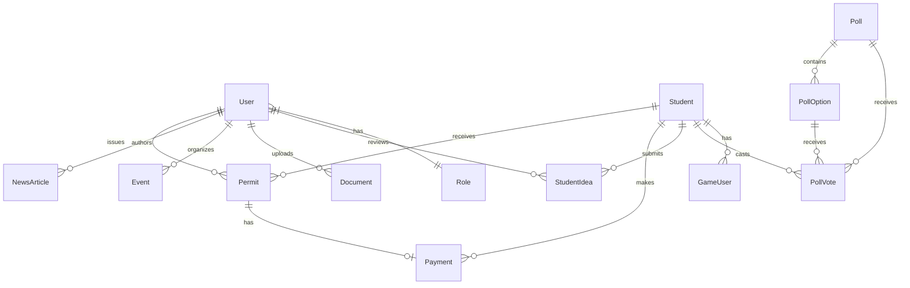
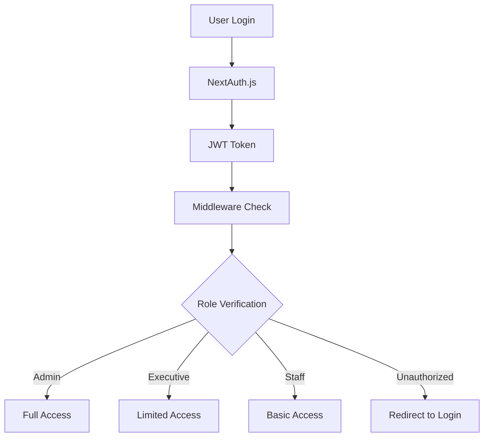
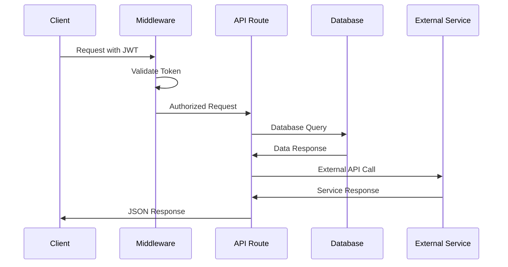

# Knutsford University SRC Dashboard - Architecture Documentation

## System Architecture Overview

The Knutsford University SRC Dashboard is built on a modern, scalable
architecture that follows industry best practices for security, performance, and
maintainability.

## Technology Stack

### Frontend Technologies

- **Next.js 15** - React framework with App Router
- **TypeScript** - Type-safe JavaScript development
- **Tailwind CSS** - Utility-first CSS framework
- **Radix UI** - Accessible component primitives
- **React Hook Form** - Form state management
- **TanStack Query** - Server state management
- **Lexical** - Rich text editor framework

### Backend Technologies

- **Next.js API Routes** - Serverless API endpoints
- **Prisma ORM** - Type-safe database access
- **MySQL** - Primary database
- **NextAuth.js** - Authentication framework
- **JWT** - Token-based authentication
- **bcryptjs** - Password hashing

### External Services

- **Paystack** - Payment processing
- **Cloudinary** - Image and file storage
- **Nodemailer** - Email services
- **QR Code** - Permit code generation

## Database Architecture

### Core Entities



### Key Models

#### User Management

- **User**: Administrators, SRC executives, staff
- **Role**: Permission-based access control
- **Student**: Student records and profiles

#### Permit System

- **Permit**: Digital permits with QR codes
- **Payment**: Financial transactions
- **AuditLog**: System activity tracking

#### Content Management

- **NewsArticle**: Campus news and announcements
- **Event**: Campus events and activities
- **Document**: File management system
- **Newsletter**: Email communications

#### Engagement Features

- **Poll**: Student voting system
- **StudentIdea**: Student suggestion system
- **GameUser**: Gaming leaderboards
- **LeaderboardEntry**: Game statistics

## Component Architecture

### Layout Structure

```
src/
├── app/                    # Next.js App Router
│   ├── dashboard/         # Protected admin routes
│   ├── auth/             # Authentication pages
│   └── api/               # API endpoints
├── components/            # Reusable components
│   ├── app/              # Feature-specific components
│   ├── ui/               # Base UI components
│   ├── layouts/          # Layout components
│   └── common/           # Shared utilities
├── lib/                  # Utilities and services
│   ├── auth/             # Authentication logic
│   ├── services/         # Business logic
│   └── utils.ts          # Helper functions
└── hooks/                # Custom React hooks
```

### Component Hierarchy

#### Dashboard Layout

- **AppSidebar**: Navigation and user menu
- **BaseLayout**: Common layout wrapper
- **NavMain**: Primary navigation
- **NavUser**: User profile and settings

#### Feature Components

- **Permit Management**: Create, verify, track permits
- **Student Management**: Student profiles and bulk operations
- **Content Management**: News, events, documents
- **Poll System**: Voting and results management
- **Settings**: System configuration

## Authentication & Authorization

### Security Model



### Role-Based Access Control

#### Admin Role

- Full system access
- User management
- System configuration
- Audit log access

#### Executive Role

- Student management
- Permit operations
- Content publishing
- Event management

#### Staff Role

- Basic permit operations
- Student lookup
- Limited content access

## API Architecture

### Endpoint Structure

```
/api/
├── auth/                 # Authentication
├── students/             # Student management
├── permits/             # Permit operations
├── payments/             # Payment processing
├── events/               # Event management
├── documents/            # File operations
├── newsletter/           # Email services
├── polls/                # Voting system
├── games/                # Gaming features
└── config/               # System settings
```

### Request/Response Flow



## Data Flow Architecture

### Permit Creation Flow

1. **Student Registration**: Student data entry
2. **Payment Processing**: Paystack integration
3. **Permit Generation**: QR code creation
4. **Email Notification**: Automated communication
5. **Database Storage**: Secure data persistence

### Content Management Flow

1. **Content Creation**: Rich text editor
2. **Media Upload**: Cloudinary integration
3. **Review Process**: Approval workflow
4. **Publication**: Scheduled or immediate
5. **Distribution**: Newsletter and website

## Performance Optimizations

### Database Optimizations

- **Indexed queries** for fast lookups
- **Connection pooling** for scalability
- **Query optimization** with Prisma
- **Caching strategies** for frequently accessed data

### Frontend Optimizations

- **Code splitting** with Next.js
- **Image optimization** with Next.js Image
- **Lazy loading** for components
- **Memoization** for expensive operations

### API Optimizations

- **Rate limiting** for API protection
- **Response caching** for static data
- **Compression** for large responses
- **Pagination** for large datasets

## Security Architecture

### Data Protection

- **Encrypted passwords** with bcrypt
- **JWT tokens** for session management
- **HTTPS enforcement** for all communications
- **Input validation** with Zod schemas

### Access Control

- **Middleware protection** for routes
- **Role-based permissions** for features
- **Audit logging** for all actions
- **Session management** with secure cookies

## Deployment Architecture

### Production Environment

- **Vercel** - Frontend hosting
- **PlanetScale** - Database hosting
- **Cloudinary** - Media storage
- **Paystack** - Payment processing

### Environment Configuration

```env
# Database
DATABASE_URL="mysql://..."

# Authentication
NEXTAUTH_SECRET="..."
NEXTAUTH_URL="..."

# External Services
PAYSTACK_SECRET_KEY="..."
CLOUDINARY_URL="..."

# Email
SMTP_HOST="..."
SMTP_USER="..."
SMTP_PASS="..."
```

## Monitoring & Analytics

### System Monitoring

- **Uptime monitoring** for availability
- **Performance metrics** for optimization
- **Error tracking** for debugging
- **User analytics** for insights

### Business Metrics

- **Permit processing** statistics
- **User engagement** metrics
- **Payment success** rates
- **System usage** patterns

## Scalability Considerations

### Horizontal Scaling

- **Stateless API** design
- **Database connection** pooling
- **CDN integration** for assets
- **Load balancing** capabilities

### Future Enhancements

- **Microservices** architecture
- **Event-driven** processing
- **Real-time** notifications
- **Mobile API** development

---

_This architecture provides a solid foundation for the current system while
maintaining flexibility for future enhancements and scaling requirements._
