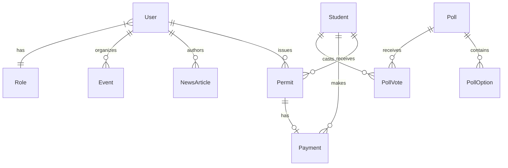

# CHAPTER THREE: SYSTEM ANALYSIS AND DESIGN

## 3.1 Introduction

This chapter explains how the system was developed. It covers the analysis of the existing system, the analysis of the proposed system (including requirements), and the design and architecture of the proposed system, including database design, system logic design, user interface design, and the system test plan.

## 3.2 Analysis of the Existing System

### 3.2.1 Detailed Description of the Existing System

The existing setup at the university (before the SRC Dashboard) can be characterised as follows:

- **Scope**: Permit issuance and renewal, student records, event publicity, and general announcements were handled through a combination of manual processes, spreadsheets, and possibly separate tools or email.
- **How it worked**: Staff received permit requests, verified student information manually, collected payments through designated channels, and issued permits (e.g. physical or simple digital documents). Events and news were publicised via notice boards, social media, or email without a single source of truth. Student data were maintained in spreadsheets or local records, not necessarily linked to permits or payments.

### 3.2.2 Challenges Associated with the Existing System

- Long turnaround time for permit processing.
- No instant verification of permit validity at gates or offices.
- Duplication of effort and risk of inconsistency across student data, events, and communications.
- Difficulty in generating accurate, timely reports for management.
- Limited traceability and auditability of who did what and when.
- Administrative burden on staff and delays for students.

### 3.2.3 Detailed Definition of the Problem (System Request)

The system request was to provide a web-based SRC Dashboard that:

- Allows authorised users to create, track, and verify student permits with unique codes (e.g. QR).
- Maintains student profiles and links them to permits and payments.
- Integrates with a payment gateway (Paystack) for permit fees.
- Supports event management, news/articles, document management, and newsletters.
- Provides polls and student idea submission for engagement.
- Enforces role-based access (e.g. admin, executive, staff) and keeps audit logs.
- Is responsive, secure, and deployable for use by the university.

## 3.3 Analysis of the Proposed System

### 3.3.1 Requirements of the Proposed System

#### 3.3.1.1 Functional and Non-Functional Requirements

**Functional requirements** (summary):

- User registration, login, and role-based access (admin, executive, staff).
- CRUD operations for students; linking students to permits and payments.
- Permit creation with unique code/QR; status and expiry tracking; verification endpoint/page.
- Payment initiation and verification via Paystack; recording payment status and linking to permits.
- Event creation, editing, publishing; news/article management; document upload and listing; newsletter creation and sending.
- Poll creation and voting; student idea submission and review.
- Configuration (e.g. contact info, semester, permit settings); audit logging; reporting.

**Non-functional requirements**:

- Security: password hashing (bcrypt), JWT/session-based auth, HTTPS.
- Performance: responsive UI, efficient queries (indexing), pagination for large lists.
- Usability: clear navigation, responsive layout, accessibility considerations.
- Maintainability: structured code, TypeScript, documented APIs and environment variables.

#### 3.3.1.2 User Interface Requirements

- Dashboard layout with sidebar navigation and role-appropriate menu items.
- Forms for students, permits, events, news, documents, newsletters, and polls with validation and feedback.
- Data tables with search, filter, and pagination where applicable.
- Permit verification interface (e.g. by code or QR scan) showing validity and basic student/permit info.
- Responsive design for use on desktop and tablet; consistent theme (e.g. light/dark).
- Clear labels, error messages, and success feedback for all actions.

#### 3.3.1.3 System Requirements (Hardware, Software, Platform)

- **Server**: Node.js 18+ runtime; support for environment variables and file system where needed.
- **Database**: MySQL 8.0+ (or compatible); network access from application server.
- **Client**: Modern browser (Chrome, Firefox, Safari, Edge) with JavaScript enabled.
- **External services**: Paystack (payment), Cloudinary (media), SMTP (email); internet connectivity required.
- **Deployment**: Can be hosted on Vercel, or any Node.js-capable host with MySQL and env configuration.

## 3.4 Design and Architecture of the Proposed System

### 3.4.1 Database Design

The system uses a relational schema (MySQL) with the following main entities and relationships:

- **User**, **Role**: Users have a role; roles define access level.
- **Student**: Student records; linked to permits, payments, poll votes, ideas, game user (if applicable).
- **Permit**: Permit record with unique code, status, dates, amount; belongs to a student; optional link to issuing user; has optional one-to-one Payment.
- **Payment**: Amount, currency, reference, gateway reference, status; linked to student and optionally to permit.
- **NewsArticle**, **Event**, **Document**, **Newsletter**: Content entities with titles, content/URLs, status, and author/organiser (User).
- **Poll**, **PollOption**, **PollVote**: Polls with options and student votes.
- **StudentIdea**: Student-submitted ideas with status and optional reviewer (User).
- **AuditLog**: Action, user, details, timestamp.
- **Config**, **ContactInfo**, **SemesterConfig**, **PermitConfig**: System and permit configuration.

Entity-relationship diagram (conceptual):

Data dictionaries for each table (field names, types, constraints) are derived from the Prisma schema and can be listed in an appendix or in this section.

### 3.4.2 System Logic Design

- **Authentication flow**: User logs in → credentials validated → session/JWT issued → middleware checks role and route access on each request.
- **Permit creation flow**: Select/link student → set dates and amount → initiate payment (Paystack) → on success create permit with unique code → store payment and permit → notify (e.g. email).
- **Permit verification flow**: User enters code or scans QR → API looks up permit by code and status → returns validity and basic info (or “not found”/“expired”).
- **Content publishing**: Create/edit content → set status (draft/published) → store; newsletters have scheduling and send logic.

UML diagrams (e.g. use case, sequence, or activity diagrams) and data flow diagrams (DFD) can be added here to illustrate these flows; they should be prepared according to your programme’s conventions.

### 3.4.3 User Interface Design

- **Layout**: App sidebar for navigation; main content area; header with user menu and theme toggle.
- **Screens**: Dashboard home (summary stats); Students (list, add/edit, detail); Permits (list, create, detail, verify); Events, News, Documents, Newsletter, Polls (list and manage); Settings (config, users, reports); Permit verification (public or staff-only page).
- **Components**: Reusable UI (buttons, forms, tables, cards, modals) from a shared library (e.g. Radix-based); forms use validation (e.g. Zod) and clear error/success states.

Wireframes or screenshots can be included in the report or appendices.

### 3.4.4 System Test Plan

- **Unit/component tests**: Critical business logic and validation (e.g. permit creation rules, payment status updates) where tests exist.
- **Integration tests**: API routes (e.g. permit creation, verification, payment callback) with test database or mocks.
- **User acceptance (UAT)**: Key flows—login, create student, create permit (with test payment), verify permit, create event, create poll—verified by representative users.
- **Security**: Access control (unauthorised users cannot access admin routes); input validation and error handling on APIs.
- **Performance**: Key pages and API response times under typical load; database query efficiency (indexes) verified.

Test results can be summarised in table form in Chapter Four.
